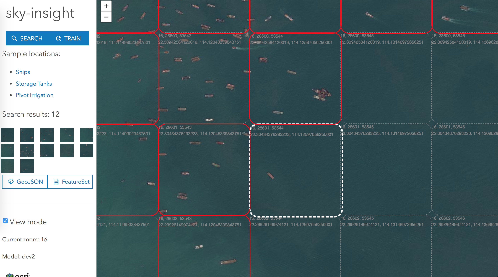

# sky-insight




Easily train machine learning models using satellite/aerial imagery & ArcGIS.

Enrich your existing GIS data with real world planetary data in near realtime ML models.

Monitor the physical world with ease using automation & image classification.

## Build & Run

``` bash
# install dependencies
npm install

# serve with hot reload at localhost:8080
npm run dev

# build for production with minification
npm run build
```

For detailed explanation on how things work, consult the [docs for vue-loader](http://vuejs.github.io/vue-loader).
